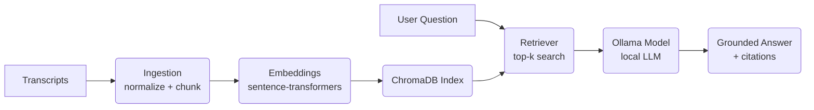

# DESIGN

## Goal

Return actionable YouTube advice **grounded only in the supplied transcripts**, with precise citations in the format:
`[source: <filename> t=MM:SS–MM:SS]`.

## Architecture

1. **Ingestion**

   * Read transcripts
   * Normalize text
   * Split into chunks aligned with timestamp spans

2. **Embedding + Index**

   * Use `sentence-transformers` to embed chunks
   * Store embeddings in **ChromaDB** for similarity search

3. **Retriever**

   * Query ChromaDB to retrieve top-k relevant chunks for a given question

4. **Generator**

   * Prompt a local **Ollama model** (e.g., `llama2`, `mistral`, or another installed model) using retrieved passages
   * Instruct it to:

     * Provide actionable recommendations
     * Add citations in the exact format (filename + timestamp)
     * Decline to answer if transcripts lack the necessary information

## Citation format

Machine-checkable format:
`[source: <filename> t=MM:SS–MM:SS]`

## Tests

* **`test_schema.py`**: verifies structure of returned answer and citation regex.
* **`test_grounding.py`**: checks that a known, groundable question returns a citation pointing to the correct transcript.
* **`test_fallback.py`**: ensures out-of-scope questions are declined gracefully.
* **`test_integration.py`**: full end-to-end test.

## Tradeoffs & Limits

* **Ollama models** are fast and local, but quality varies by model size; smaller models may underperform compared to large hosted LLMs.
* Chunks are **time-aligned but coarse**; timestamps represent chunk start/end only.
* **No external data sources** are used — answers are grounded strictly in transcripts.

## Diagram

